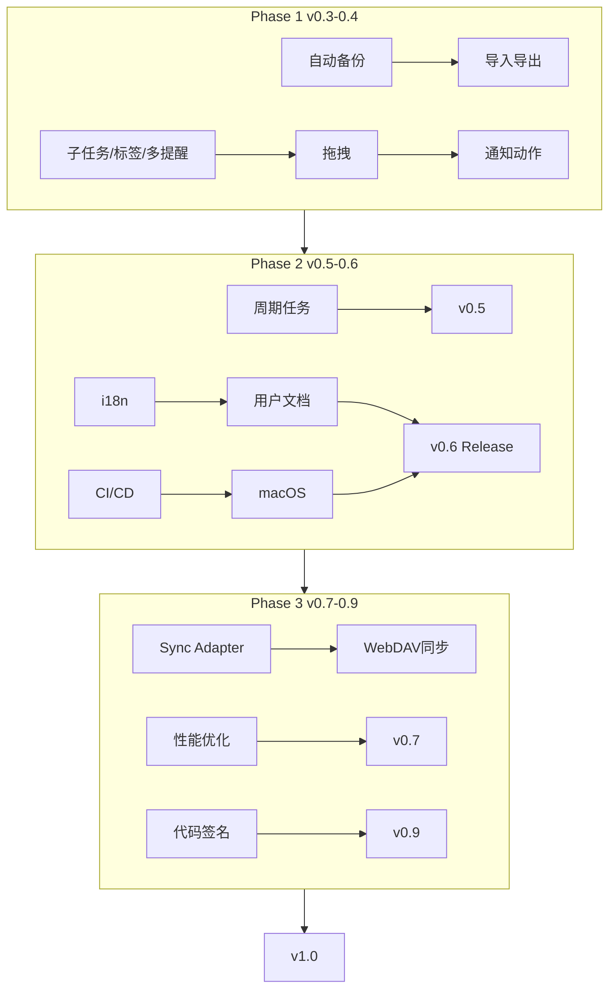

# 03 — 分阶段路线图

> 工时为人日估算（1 人全职约 8h/日），含自测与文档；实际可按业余时间折算周数。  
> 每个版本发布前更新 `CHANGELOG.md` 并打 git tag，流程见 [`AGENT.md`](../AGENT.md) §11。

---

## Phase 1：好用（v0.3 – v0.4）

**主题**：补齐「schema 已有但 UI 没有」的核心能力，让产品从「能用」到「日常好用」。  
**周期**：约 4–8 周（35–55 人时）  
**平台**：Windows only

### v0.3.0 — 核心体验补齐

**发布标语**：子任务、标签、多提醒、自动备份

| ID | 任务 | 工时 | 交付标准 |
|----|------|------|----------|
| P1-01 | 子任务 UI（TaskForm + TaskCard 进度） | 6h | 可增删改排序；显示 3/5 完成度 |
| P1-02 | 标签 UI（表单多选 + 设置页管理 + chip） | 8h | 创建标签配色；看板/月历展示 |
| P1-03 | 多提醒列表 | 4h | 一任务多条；改 due 后提醒逻辑正确 |
| P1-04 | 每日自动 DB 备份 | 3h | `%APPDATA%/.../backups/`，保留 7 天 |
| P1-05 | 休眠唤醒补发提醒 | 4h | 监听 power resume，主动 `fire_due` |
| P1-06 | Release 日志级别 INFO | 0.5h | 生产环境无 SQL DEBUG 洪水 |
| P1-07 | 设计 token 初版（颜色/优先级/shadow） | 4h | `design-tokens` 或 CSS 变量收敛 |
| P1-08 | 错误文案包装 | 3h | API 层用户可读错误，非 sqlx 原文 |

**里程碑验收**：新用户可创建带 3 个子任务、2 个标签、2 个提醒的任务；删库可从昨日备份恢复。

---

### v0.4.0 — 交互飞跃

**发布标语**：拖拽改期、导入导出、通知动作、稳定性

| ID | 任务 | 工时 | 交付标准 |
|----|------|------|----------|
| P1-09 | 看板拖拽（dnd-kit） | 8h | 跨列改状态/日期；排序持久化 |
| P1-10 | 月历拖拽改期 | 6h | 拖任务到其他日期格 |
| P1-11 | 导入导出 JSON | 5h | 全量导出；导入合并/覆盖可选 |
| P1-12 | 导出 Markdown（只读） | 3h | 按日期列出任务标题 |
| P1-13 | 通知 action buttons | 6h | 完成 / 稍后 5 分钟 / 打开应用 |
| P1-14 | Undo 删除（软删 5s） | 4h | Toast 带恢复 |
| P1-15 | 月历日详情侧栏 | 5h | 点击日期展示当日全部任务 |
| P1-16 | 关键单元测试 | 8h | datetime、lunar、scheduler SQL |
| P1-17 | Win10 冒烟测试清单 | 4h | 通知/托盘/自启记录结果 |

**里程碑验收**：核心路径有测试；Windows 10/11 通知动作可用；数据可 JSON 迁移。

---

## Phase 2：可发布（v0.5 – v0.6）

**主题**：非技术用户能上手，工程可重复发布，开始跨平台。  
**周期**：约 8–12 周（60–90 人时）

### v0.5.0 — 产品化基础

**发布标语**：多语言、周期任务、设置完善、新手引导

| ID | 任务 | 工时 | 交付标准 |
|----|------|------|----------|
| P2-01 | i18n 框架（react-i18next） | 8h | 简中 / 繁中 / 英文切换 |
| P2-02 | 文案外迁与翻译 | 12h | 主界面 100% 走 i18n key |
| P2-03 | 周期任务（RRULE 或简化规则） | 12h | 日/周/月；完成生成下一实例 |
| P2-04 | 设置扩展 | 6h | 时区、周起始、默认提醒、城市覆盖 |
| P2-05 | 新手引导 v2 | 4h | 3 步：创建 → 提醒 → 视图切换 |
| P2-06 | 活动日志面板 | 6h | 最近创建/完成/删除列表 |
| P2-07 | 右键任务菜单 | 4h | 改期/优先级/完成/删除 |
| P2-08 | GitHub Actions CI | 6h | PR：lint + typecheck + test |
| P2-09 | 用户文档初版 | 8h | `docs/user/` 或官网：安装、备份、FAQ |

**里程碑验收**：英文界面可用；CI 绿灯；FAQ 覆盖安装与备份。

---

### v0.6.0 — macOS 与发布流水线

**发布标语**：macOS 原生体验、自动构建、License 定案

| ID | 任务 | 工时 | 交付标准 |
|----|------|------|----------|
| P2-10 | macOS 构建与通知/托盘 | 16h | DMG 可安装；通知与菜单栏正常 |
| P2-11 | macOS 开机启动 | 4h | 与 Windows 行为一致 |
| P2-12 | Tag 触发 Release 构建 | 8h | Actions 产出 Win + macOS 安装包 |
| P2-13 | Dependabot 配置 | 1h | 依赖安全更新 PR |
| P2-14 | LICENSE 与隐私政策 | 4h | 仓库根目录 + 设置内链接 |
| P2-15 | GitHub Issue 模板 | 2h | Bug / Feature 模板 |
| P2-16 | 全局热键（系统级快速新增） | 8h | Ctrl+Shift+T（可配置） |
| P2-17 | 任务模板 | 6h | 预设模板一键创建 |
| P2-18 | 批量选择与操作 | 8h | Shift 多选批量完成/删除 |

**里程碑验收**：push tag 后 30 分钟内可下载双平台安装包；License 与隐私政策可公开访问。

---

## Phase 3：可增长（v0.7 – v0.9）

**主题**：多设备、集成、性能、分发渠道。  
**周期**：约 12–16 周（80–120 人时）

### v0.7.0 — 同步与集成（本地仍默认）

| ID | 任务 | 工时 | 交付标准 |
|----|------|------|----------|
| P3-01 | Sync Adapter 接口 + 本地 no-op | 6h | 架构边界清晰 |
| P3-02 | WebDAV 同步（E2E 加密可选） | 20h | 双设备增量同步；冲突策略文档化 |
| P3-03 | 应用内检查更新 | 6h | 对比 GitHub Releases API |
| P3-04 | 性能：月历窗口查询 | 8h | 1k 任务月历切换 < 100ms 体感 |
| P3-05 | 天气缓存持久化 | 3h | settings 表缓存 + stale 刷新 |
| P3-06 | 可选 Sentry（默认关） | 4h | 设置开关 + 隐私说明 |

---

### v0.8.0 — Linux 与日历集成

| ID | 任务 | 工时 | 交付标准 |
|----|------|------|----------|
| P3-07 | Linux AppImage/deb 构建 | 12h | 社区版标注「未充分测试」 |
| P3-08 | ICS 导入（单向） | 8h | 从 Google/Outlook 导出 ICS 导入 |
| P3-09 | ICS 导出（单向） | 4h | 订阅 URL 或文件导出 |
| P3-10 | 跨日任务连续色条 | 16h | 月历 lane 布局 |
| P3-11 | 无障碍：月历键盘导航 | 6h | Tab + 方向键 |
| P3-12 | forced-colors 高对比 | 4h | Windows 高对比可读 |

---

### v0.9.0 — 分发与签名

| ID | 任务 | 工时 | 交付标准 |
|----|------|------|----------|
| P3-13 | Windows 代码签名 | 8h | 减少 SmartScreen 警告 |
| P3-14 | macOS 公证 notarization | 8h | Gatekeeper 通过 |
| P3-15 | 官网 / GitHub Pages 落地页 | 8h | 下载链接、截图、特性 |
| P3-16 | Microsoft Store 评估 | 4h | 可行性报告（可不实际上架） |
| P3-17 | Pomodoro 基础版 | 10h | 与任务关联计时 |
| P3-18 | 压力测试 5k/10k 任务 | 6h | 记录瓶颈与优化项 |

---

## Phase 4：v1.0 通用产品

**主题**：对外宣称的「正式版」—— 稳定、文档全、双平台主力、商业模式落地。  
**周期**：约 4–6 周（30–50 人时）收尾 + 2 周公测

### v1.0.0 发布门禁

| 类别 | 必达项 |
|------|--------|
| 功能 | Phase 1 全部 + Phase 2 的 i18n / CI / 周期任务 / 全局热键 |
| 平台 | Windows 10/11 + macOS 最近两个 major 验证通过 |
| 质量 | 核心 lib + scheduler 测试；无 P0/P1 开放 bug |
| 文档 | 用户手册、隐私政策、CHANGELOG、README 产品化表述 |
| 法律 | LICENSE 定案；第三方服务披露 |
| 品牌 | 图标、Bundle ID（若变更则迁移说明）、统一产品名 |
| 分发 | GitHub Releases 双平台签名包；官网下载页 |

### v1.0 可选纳入（时间够再做）

- WebDAV 同步（Phase 3）
- Linux 社区版
- 应用商店上架

### v1.0 明确不包含

- 团队协作编辑
- 移动端 App
- AI 任务拆解
- Google/Outlook **双向**实时同步

---

## Phase 5：愿景（v2.0+）

> 无固定排期，按 v1.0 反馈与市场验证再立项。

| 方向 | 内容 |
|------|------|
| 移动端 | Tauri 2 移动目标或 React Native 伴侣只读 + 提醒 |
| 协作 | 共享只读列表、家庭空间（仍本地优先可选同步） |
| AI | 自然语言创建任务、排期建议、过载提醒 |
| 深度集成 | Outlook/Google 双向同步、Webhook 推送手机 |
| 商业化 | Pro 订阅功能边界落地（若 Phase 2 选了 B/D 方案） |

---

## 版本时间线（示意）

```
2026 Q3    v0.3 – v0.4   Phase 1 好用
2026 Q4    v0.5 – v0.6   Phase 2 可发布
2027 Q1    v0.7 – v0.9   Phase 3 可增长
2027 Q2    v1.0.0        通用产品正式版
2027 H2+   v2.x           愿景功能
```

> 以上为单人业余/半职节奏示意；全职可压缩约 40–50%。

---

## 依赖关系简图



---

## 风险与缓冲

| 风险 | 影响 | 缓解 |
|------|------|------|
| macOS 通知/托盘 API 差异 | Phase 2 延期 | 尽早起 macOS CI，每周构建 |
| Bundle ID 变更丢数据 | 用户流失 | v0.6 前定案；提供 DB 路径迁移工具 |
| 同步冲突复杂 | Phase 3 膨胀 | v1.0 可仅 JSON 手动同步；WebDAV 作 v1.1 |
| 单人开发带宽 | 全线延期 | 每版只承诺 1 个主题；其余进 backlog |
| 商店审核 | 额外 2–4 周 | v1.0 先 GitHub Releases，商店作 v1.1 |

---

## Backlog（不绑定版本，按反馈插队）

- 周视图 / 日视图
- OpenCC 完整繁简转换
- 多天气 provider fallback
- 主题跟随系统
- 自定义列（看板）
- 插件系统
- 命令面板（Cmd+K）

维护方式：GitHub Issues 加标签 `backlog` / `v0.x` / `v1.0` / `vision`。
